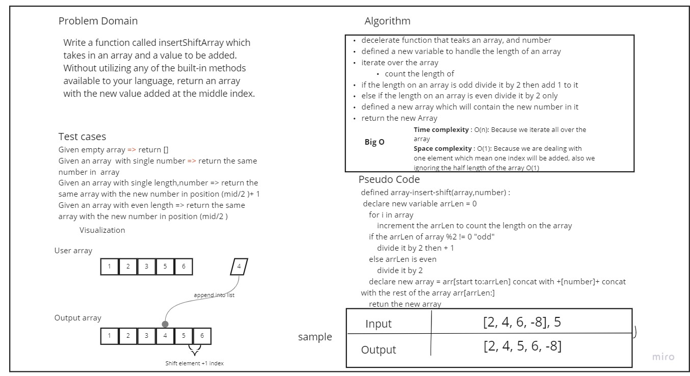

# Insert to Middle of an Array

 Write a function called insertShiftArray which takes in an array and a value to be added. Without utilizing any of the built-in methods available to your language, return an array with the new value added at the middle index.

## Whiteboard Process

## Approach & Efficiency
<!-- What approach did you take? Discuss Why. What is the Big O space/time for this approach? -->
* I used skip the half of an array then insert
* I think it's better way to save memory and time.
* Big O time Complexity: O(n)
* Big O space Complexity: O(1)
