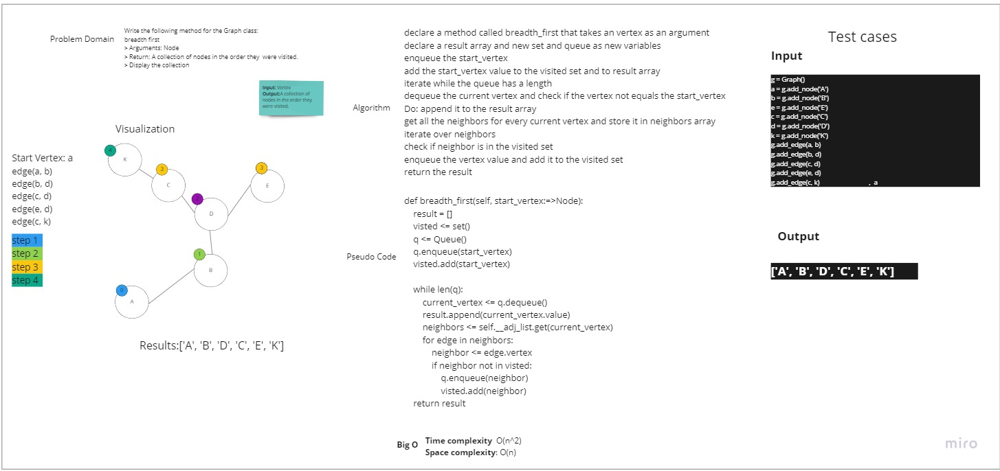

# Breadth-First Traversal of a Graph
## Challenge Summary

Implement a breadth-first traversal on a graph.

Write the following method for the Graph class:
* breadth first
* Arguments: Node
* Return: A collection of nodes in the order they were visited.
* Display the collection

### Whiteboard

### Approach & Efficiency
Using queue to comparing and storing the vertices value and set to make it as flag for visited values 

#### Efficiency:
Time complexity:O(n^2)

Space complexity:O(n)

### Solution
```
 declare a method called breadth_first that takes an vertex as an argument

 declare a result array and new set and queue as new variables

 enqueue the start_vertex

 add the start_vertex value to the visited set and to result array

 iterate while the queue has a length

 dequeue the current vertex and check if the vertex not equals the start_vertex

 Do: append it to the result array

 get all the neighbors for every current vertex and store it in neighbors array

 iterate over neighbors

 check if neighbor is in the visited set 

 enqueue the vertex value  and add it to the visited set 

 return the result
```


[Code](https://github.com/muhammadqasemtarboush1/data-structures-and-algorithms/blob/main/graph/graph.py)


[Test](https://github.com/muhammadqasemtarboush1/data-structures-and-algorithms/blob/main/tests/test_graph_bfs.py)


