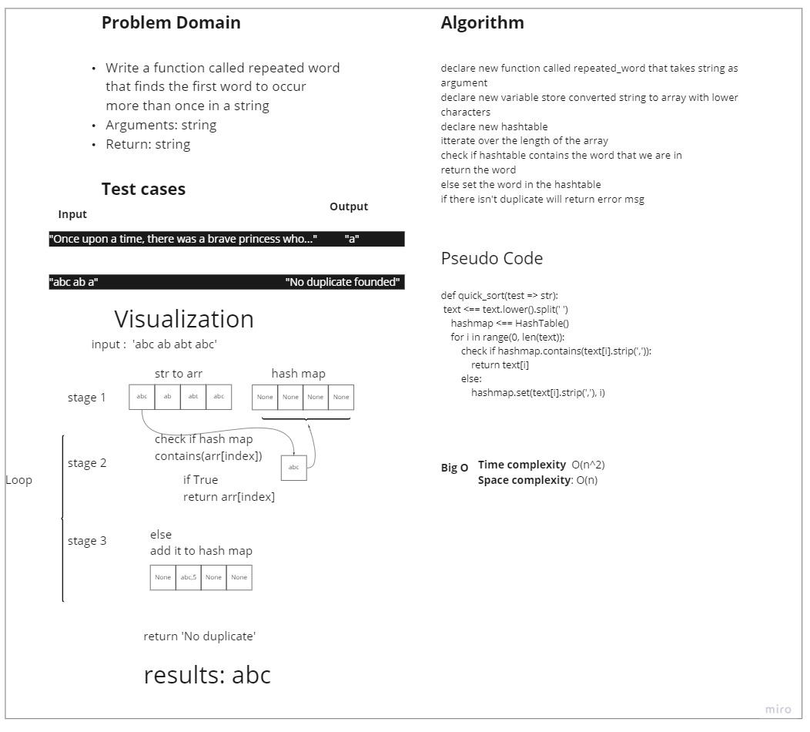

# Challenge Summary
<!-- Description of the challenge -->
Write a function called repeated word that finds the first word to occur more than once in a string
Arguments: string
Return: string

## Whiteboard Process
<!-- Embedded whiteboard image -->

## Approach & Efficiency
<!-- What approach did you take? Why? What is the Big O space/time for this approach? -->
I used the last built methods in the HashTable get and set to set the words in
the hash map and comparing the exists using get method

### Efficiency:
Time complexity: O(n^2) we are looping over n of string and using the set and get with O(n) time complexity
Space complexity: O(n)

## Solution
<!-- Show how to run your code, and examples of it in action -->
**Algorithm**:

declare new function called repeated_word that takes string as argument
declare new variable store converted string to array with lower characters
declare new hashtable
itterate over the length of the array
check if hashtable contains the word that we are in 
return the word 
else set the word in the hashtable
if there isn't duplicate will return error msg

[Code](https://github.com/muhammadqasemtarboush1/data-structures-and-algorithms/blob/main/trees/helper_functions/tree_fizz_buzz/tree_fizz_buzz.py)
[Test]()

> For testing
>
> you can run :
>
> pytest -v
>
> or
>
>  pytest .\tests\test_hashmap_repeated_word.py

