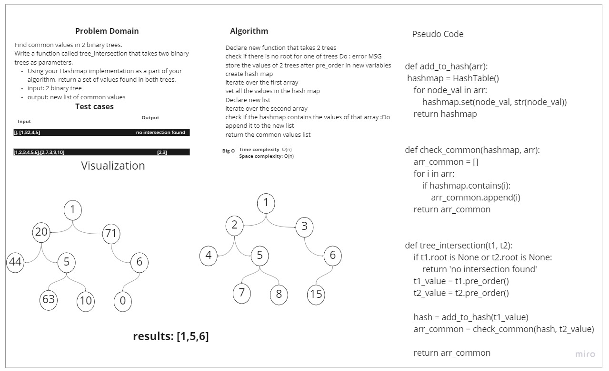

# Challenge Summary
<!-- Description of the challenge -->
Find common values in 2 binary trees.
Write a function called tree_intersection that takes two binary trees as parameters.
Using your Hashmap implementation as a part of your algorithm, return a set of values found in both trees.

## Whiteboard Process
<!-- Embedded whiteboard image -->

## Approach & Efficiency
<!-- What approach did you take? Why? What is the Big O space/time for this approach? -->
I used the pre_order method to get the tree values into arrays and I create helper function to create hash map and set one of 
the trees into hash maps, also use another function to check common values and 
return new list of most common values

Time complexity: O(n)

Space complexity: O(n)
## Solution
<!-- Show how to run your code, and examples of it in action -->
### Algorithm:
 Declare new function that takes 2 trees

 check if there is no root for one of trees Do : error MSG

 store the values of 2 trees after pre_order in new variables

 create hash map

 iterate over the first array

 set all the values in the hash map

 Declare new list 

 iterate over the second array 

 check if the hashmap contains the values of that array :Do append it to the new list

 return the common values list
 
