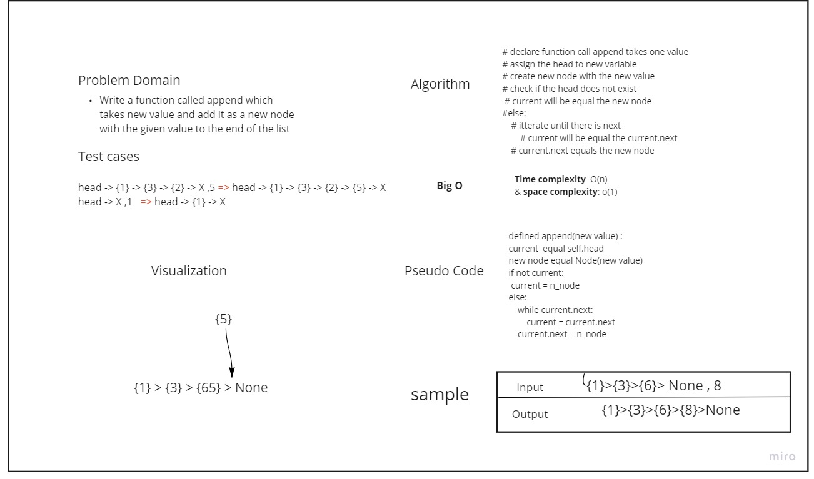
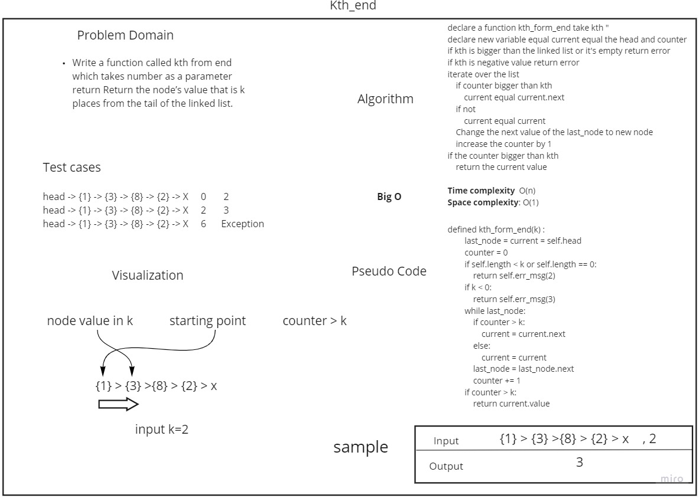

# Singly Linked List

A linked list is a linear data structure, in which the elements are not stored at contiguous memory locations.
## Challenge
### Challenge Type: New Implementation
### Features:
- Node.
- Linked List
  - insert
  - include
  - to string
  - append
  - insert before
  - insert after
  - kth_form_end
- Testing

## Approach & Efficiency
Singly Linked List.
Big O:

Time complexity:
 - insert : (1)
 - include : (n)
 - to string : (n)
 - append : (n)
 - insert after : (n)
 - insert before : (n)
 - kth_form_end : (n)

Space complexity:
 - insert: (n)
 - include: (1)
 - to string : (1)
 - append : (1)
 - insert after : (1)
 - insert before : (1)
 - kth_form_end (1)

## Whiteboard Process
* append 
  * 
* insert before 
  * 
* insert after
  * 
* kth_form_end: 
  * 
## API
<!-- Description of each method publicly available to your Linked List -->
> Insert:
> >Take a value and insert it into the first node 
> >return None
> 
> include: 
> > Take a value and search in the linked list if exists return True 
> > else : return False
> 
> To string:
>> return a collection of all the values that exist in the linked list
> > 
> Append:
>> parameters: value
> 
>> functionally: adds a new node with the given value to the end of the list
> 
> insert before:
>> parameters: search value, new value
> 
>> functionally: adds a new node with the given new value immediately before the first node that has the value specified
>  
> insert after:
>> parameters: search value, new value
> 
>> functionally: adds a new node with the given new value immediately after the first node that has the
value specified
> 
> kth form end:
>> parameters: kth
> 
>> functionally: return the node value with the given kth 