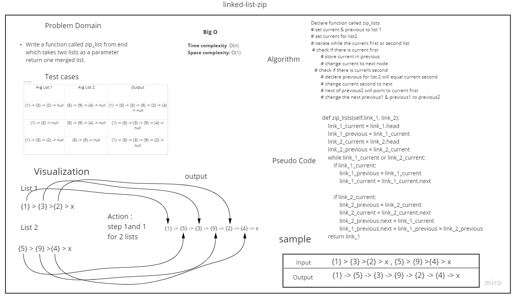

# Zip List

# Challenge Summary
Write a function called zip lists that take  Arguments: 2 linked lists and 
Return: New Linked List, zipped as noted below

## Whiteboard Process

## Approach & Efficiency
<!-- What approach did you take? Why? What is the Big O space/time for this approach? -->

Time complexity:
 - zip_lists : (n)
Space complexity:
 - zip_lists : (1)
useing itteration throughthe available list head which will give the best time and space complexity 

## Solution
<!-- Show how to run your code, and examples of it in action -->
Declare function called zip_lists
* set current & previous to list 1
* set current for list2
* iterate while the current first or second list
  * check if there is current first
    * store current in previous
    * change current to next node
  * check if there is current second
    * declare previous for list 2 will equal current second
    * change current second to next
    * next of previous2 will point to current first
    * change the next previous1 & previous1 to previous2