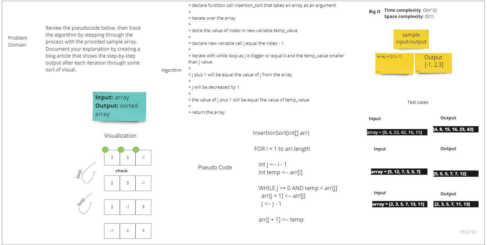

# Challenge Summary
<!-- Description of the challenge -->
Review the pseudocode below, then trace the algorithm by stepping through
the process with the provided sample array. Document your explanation by
creating a blog article that shows the step-by-step output after each
iteration through some sort of visual.

## Whiteboard Process
<!-- Embedded whiteboard image -->

## Approach & Efficiency
<!-- What approach did you take? Why? What is the Big O space/time for this approach? -->
we used the insertion sort array that used nested loops and swapping the elements depending 
on the logic of the insertion sort array

Time complexity: O(n^2)
Space Complexity: O(1)
## Solution
<!-- Show how to run your code, and examples of it in action -->
> declare function call insertion_sort that takes an array as an argument
> 
> iterate over the array
> 
> store the value of index in new variable temp_value
> 
> declare new variable call j equal the index - 1
> 
> iterate with while loop as j is bigger or equal 0 and the temp_value smaller than j value
> 
> j plus 1 will be equal the value of j from the array 
> 
> j will be decreased by 1 
> 
> the value of j plus 1 will be equal the value of temp_value 
> 
> return the array 

--- 
[Code](https://github.com/muhammadqasemtarboush1/data-structures-and-algorithms/blob/main/sorting/insertion/insertion.py)

> Testing:
> 
> * make sure .venv is running and you have pytest installed
> 
> You Can run the test by the following command in the root directory:
> 
> pytest .\tests\test_insertion_sort.py // 4 passed
> 
> > or 
> 
> pytest -v 

