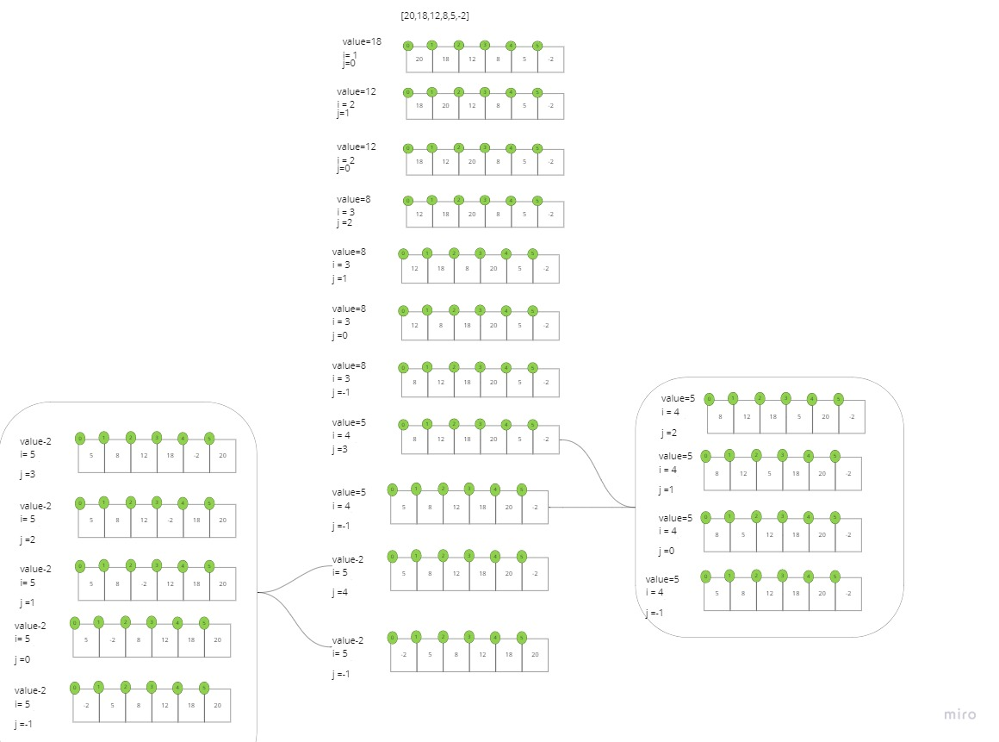

Pseudocode:
'''python
InsertionSort(int[] arr)

    FOR i = 1 to arr.length

      int j <-- i - 1
      int temp <-- arr[i]

      WHILE j >= 0 AND temp < arr[j]
        arr[j + 1] <-- arr[j]
        j <-- j - 1

      arr[j + 1] <-- temp
'''

--- 
Trace:
Sample Array: [20,18,12,8,5,-2]
code visualization

> Pass 1:
> 
>We deal with the first element in the array is as sorted. then we take second element and store it in temp variable.
comparing the temp variable with the first index value if it is smaller than swap it.

> Pass 2:
> 
> the current array = [18,20,12,8,5,-2]
>
>now take 3rd element 12 and see if it is smaller than 20 replace it, and continue check with the
previous element like 18

> Pass 3:
the current array = [12, 18, 20, 8, 5, -2]
doing the same process as above until we done
> - [8, 12, 18, 20, 5, -2]
> - [5, 8, 12, 18, 20, -2]
> - [-2, 5, 8, 12, 18, 20]
---
> Pass 4:
return the sorted array
[-2, 5, 8, 12, 18, 20]

---
Efficency
* Time: 
    - O(n^2)The basic operation of this algorithm is comparison. 
    - This will happen n * (n-1) number of times...concluding the algorithm to be n squared.
* Space: 
  - O(1)No additional space is being created.
  - This array is being sorted in place...keeping the space at constant O(1).
    