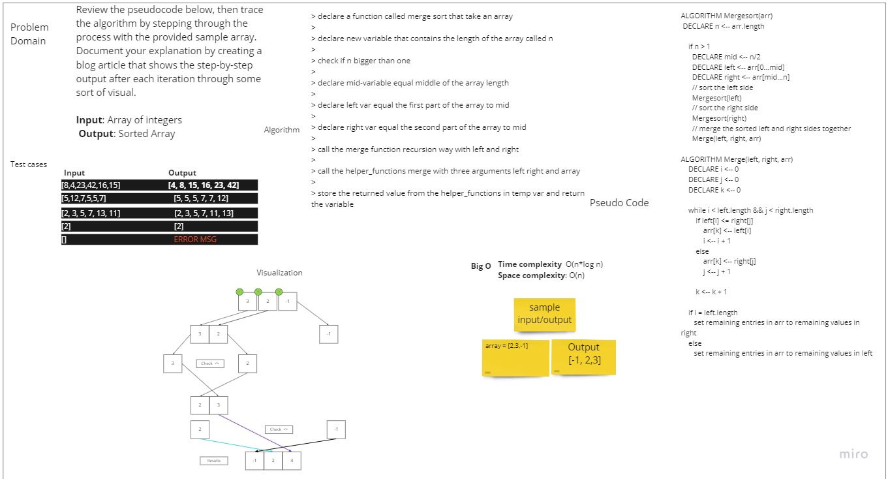

# Challenge Summary

<!-- Description of the challenge -->
Review the pseudocode for Merge sort, then trace the algorithm by stepping through the process with the provided
sample array. Document your explanation by creating a blog article that shows the step-by-step output after
each iteration through some sort of visual.

## Whiteboard Process

<!-- Embedded whiteboard image -->

## Approach & Efficiency

<!-- What approach did you take? Why? What is the Big O space/time for this approach? -->
We check if the array length is bigger than one, and we divide it to spread array and using helper_functions
call merge this function will be splitting the arguments and sorting it individually in the last step will
start merge the sorted array with each other.

Time complexity:  O(nlogn)
Space complexity: O(n)

## Solution

<!-- Show how to run your code, and examples of it in action -->

> declare a function called merge sort that take an array
>
> declare new variable that contains the length of the array called n
>
> check if n bigger than one
>
> declare mid-variable equal middle of the array length
>
> declare left var equal the first part of the array to mid
>
> declare right var equal the second part of the array to mid
>
> call the merge function recursion way with left and right
>
> call the helper_functions merge with three arguments left right and array
>
> store the returned value from the helper_functions in temp var and return the variable

[Code](https://github.com/muhammadqasemtarboush1/data-structures-and-algorithms/blob/main/sorting/merge/merge.py)
[Trace](https://github.com/muhammadqasemtarboush1/data-structures-and-algorithms/blob/main/sorting/merge/trace.md)

> Testing:
>
> * make sure .venv is running, and you have pytest installed
>
> You Can run the test by the following command in the root directory:
>
> pytest .\tests\test_merge_sort.py
>
> or
>
> pytest -v 

