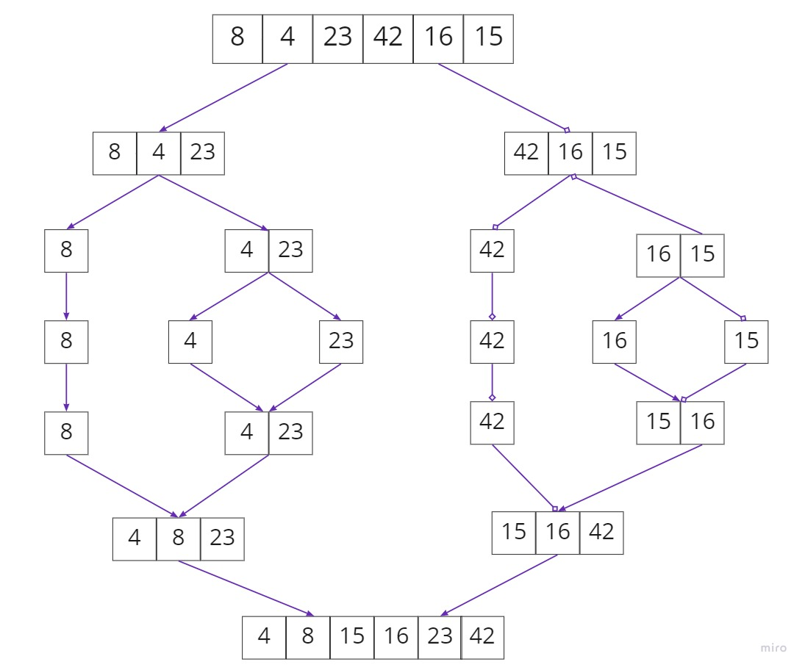

Pseudocode:

'''python

    ALGORITHM Mergesort(arr)
    DECLARE n <-- arr.length

    if n > 1
      DECLARE mid <-- n/2
      DECLARE left <-- arr[0...mid]
      DECLARE right <-- arr[mid...n]
      // sort the left side
      Mergesort(left)
      // sort the right side
      Mergesort(right)
      // merge the sorted left and right sides together
      Merge(left, right, arr)

    ALGORITHM Merge(left, right, arr)
    DECLARE i <-- 0
    DECLARE j <-- 0
    DECLARE k <-- 0

    while i < left.length && j < right.length
        if left[i] <= right[j]
            arr[k] <-- left[i]
            i <-- i + 1
        else
            arr[k] <-- right[j]
            j <-- j + 1

        k <-- k + 1

    if i = left.length
       set remaining entries in arr to remaining values in right
    else
       set remaining entries in arr to remaining values in left

'''

Trace:
Sample Array: [8,4,23,42,16,15]
code visualization

> Pass 1

we are checking the length of the array then we try to rich to elements left and right 
> Pass 2 

we incremented I and J iterators until the half each time, and K will be iterators over the hole array and sorting has been started

> Pass 3

If the value at i is less than the value at j, the left value of i is assigned to the arr[k] and i is incremented. If not, then the right will be value of j
> Pass 4

Now all the values assigned through k are sorted
> Pass 5

once the loop over and maybe there is left elements so in this case the values will be assigned to the left of in the array

Efficency
* Time: 
    - O(nlogn) This is because the array splited in log(n) calls 
    - the merging process takes linear time in each call.
* Space: 
  - O(n) we are using helper array to copy the elements to it
