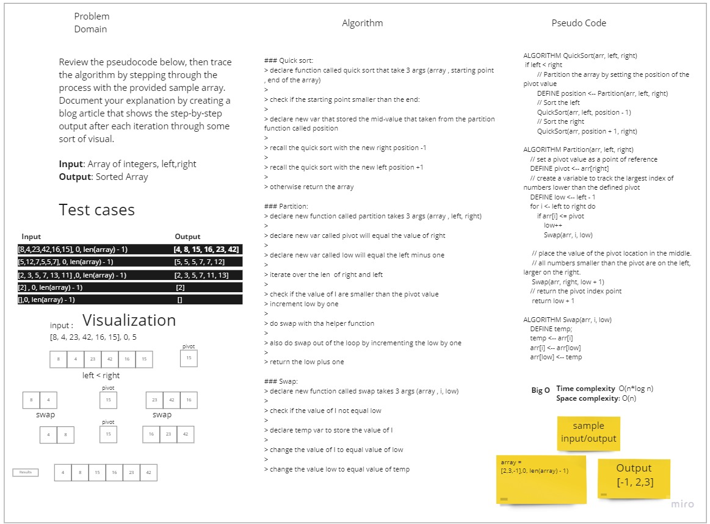

# Challenge Summary
<!-- Description of the challenge -->
Review the pseudocode below, then trace the algorithm by stepping 
through the process with the provided sample array. Document your 
explanation by creating a blog article that shows the step-by-step
output after each iteration through some sort of visual.

## Whiteboard Process
<!-- Embedded whiteboard image -->

## Approach & Efficiency
<!-- What approach did you take? Why? What is the Big O space/time for this approach? -->
Divide and conquer: splitting the array to smaller arrays until it have one element
and swap in place by using the stack memory 

Efficiency:
Time complexity: o(n^2) 
Space complexity: o(n) even if we are doing swapping in place, but we are
doing nested recursive.
## Solution
<!-- Show how to run your code, and examples of it in action -->
### Quick sort:
> declare function called quick sort that take 3 args (array , starting point , end of the array)
> 
> check if the starting point smaller than the end:
> 
> declare new var that stored the mid-value that taken from the partition function called position
>
> recall the quick sort with the new right position -1
> 
> recall the quick sort with the new left  position +1
> 
> otherwise return the array

### Partition:
> declare new function called partition takes 3 args (array , left, right)
> 
> declare new var called pivot will equal the value of right 
> 
> declare new var called low will equal the left minus one
> 
> iterate over the len  of right and left
> 
> check if the value of I are smaller than the pivot value
> increment low by one 
> 
> do swap with tha helper function 
> 
> also do swap out of the loop by incrementing the low by one
> 
> return the low plus one

### Swap:
> declare new function called swap takes 3 args (array , i, low)
> 
> check if the value of I not equal low
> 
> declare temp var to store the value of I
> 
> change the value of I to equal value of low 
> 
> change the value low to equal value of temp  

[Code](https://github.com/muhammadqasemtarboush1/data-structures-and-algorithms/blob/main/sorting/quick/quick.py)
[Trace](https://github.com/muhammadqasemtarboush1/data-structures-and-algorithms/blob/main/sorting/quick/trace.md)

> Testing:
>
> * make sure .venv is running, and you have pytest installed
>
> You Can run the test by the following command in the root directory:
>
> pytest .\tests\test_quick_sort.py
>
> or
>
> pytest -v 

