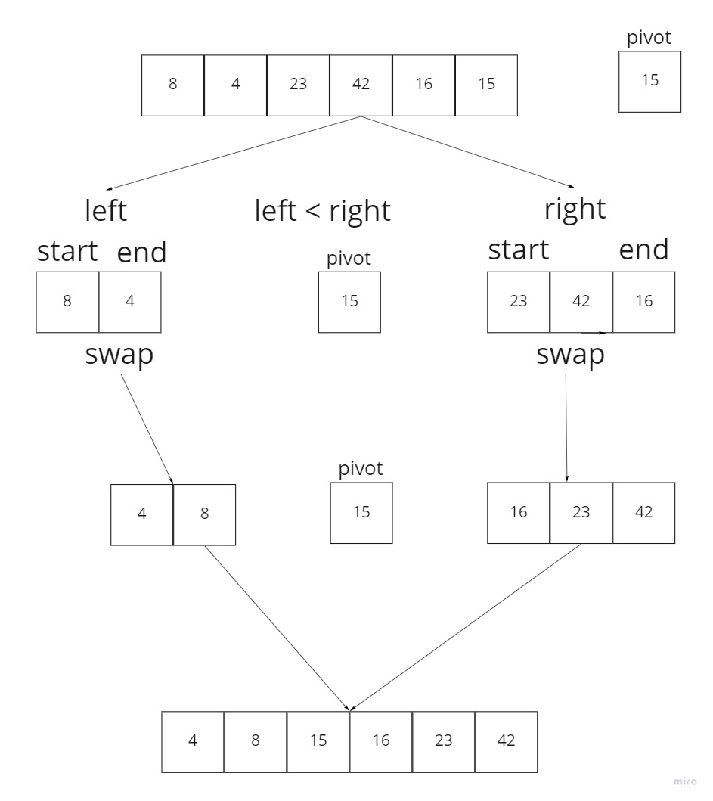

Pseudocode:
'''
    ALGORITHM QuickSort(arr, left, right)
    if left < right
        // Partition the array by setting the position of the pivot value
        DEFINE position <-- Partition(arr, left, right)
        // Sort the left
        QuickSort(arr, left, position - 1)
        // Sort the right
        QuickSort(arr, position + 1, right)

ALGORITHM Partition(arr, left, right)
    // set a pivot value as a point of reference
    DEFINE pivot <-- arr[right]
    // create a variable to track the largest index of numbers lower than the defined pivot
    DEFINE low <-- left - 1
    for i <- left to right do
        if arr[i] <= pivot
            low++
            Swap(arr, i, low)

     // place the value of the pivot location in the middle.
     // all numbers smaller than the pivot are on the left, larger on the right.
     Swap(arr, right, low + 1)
    // return the pivot index point
     return low + 1

ALGORITHM Swap(arr, i, low)
    DEFINE temp;
    temp <-- arr[i]
    arr[i] <-- arr[low]
    arr[low] <-- temp
'''

Trace:

Sample Array: [8,4,23,42,16,15]

code visualization

> Pass 1

create a pivot and create left and right of the list

> Pass 2

start moving the pointers right and left to the pivot and while we take care about they 
are greater than and smaller than pivot and check in every step to place the smaller values 
than pivot to the left and greater ones to the right

> Pass 3

place the pivot at the middle of the list and now we know the pivot left side is smaller and the right side is bigger

> Pass 4

Repeat the previous steps recursively until the left side and right side are sorted

Efficiency:
* Time complexity: 
  * o(n^2) each call that takes n time and for the main iteration it takes n also
* Space complexity:
  * o(n) even if we are doing swapping in place, but we are
    doing nested recursive.