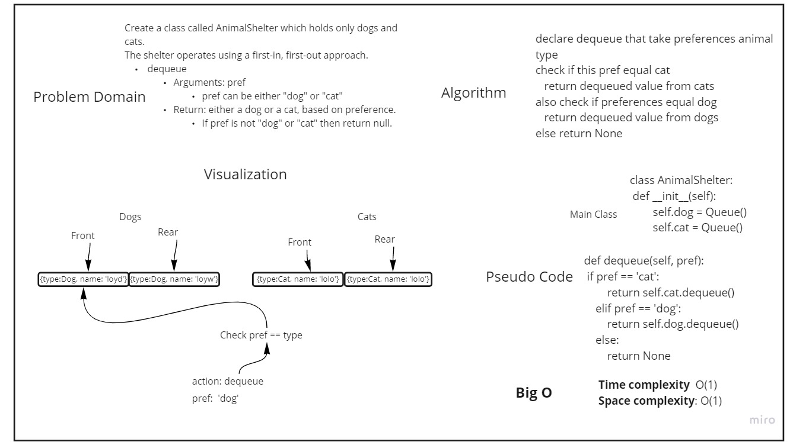

# Challenge Summary
<!-- Description of the challenge -->
Create a class called AnimalShelter which holds only dogs and cats.
The shelter operates using a first-in, first-out approach.

## Whiteboard Process
<!-- Embedded whiteboard image -->
### Enqueue

### Dequeue

## Approach & Efficiency
<!-- What approach did you take? Why? What is the Big O space/time for this approach? -->
* Time Complexity:
  * Enqueue:
    * O(1)
    * O(1)
  * Dequeue:  
    * O(1)
    * O(1)
* Space Complexity:
  * Enqueue:
    * O(1)
    * O(1)
  * Dequeue:  
    * O(1)
    * O(1)
## Solution
<!-- Show how to run your code, and examples of it in action -->

> Enqueue:
> 
> Algorithm: 
> 
> enqueue the animal to its queue depending on its type
> 
> Code:
> 
>
```python
    def enqueue(self, animal_obj):
        if animal_obj.type.lower() == 'cat':
            self.cat.enqueue(animal_obj)
        elif animal_obj.type.lower() == 'dog':
            self.dog.enqueue(animal_obj)
        return animal_obj.type
```

> Dequeue:
> 
> Algorithm: 
> 
> dequeue the animal to its queue depending on preferences
> 
> Code:
> 
>
```python
       def dequeue(self, pref):
        if pref == 'cat':
            return self.cat.dequeue()
        elif pref == 'dog':
            return self.dog.dequeue()
        else:
            return None
```


> > Testing:
> 
> * make sure .venv is running and you have pytest installed
> 
> You Can run the test by the following command in the root directory:
> 
> * pytest .\tests\test_stack_queue_animal_shelter.py // 5 tests
> 
> or to run all the tests just type:
> 
>  * pytest -v   // 49 tests