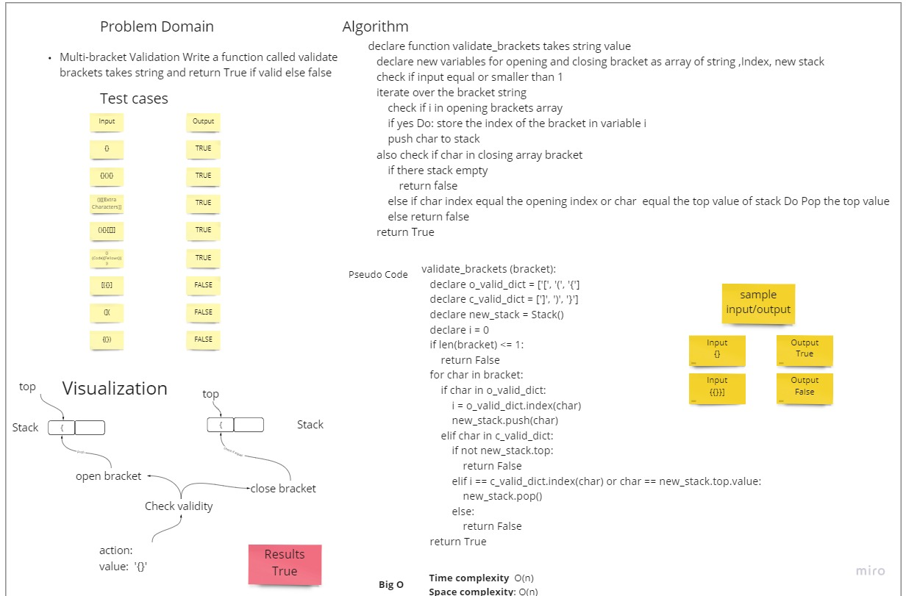

# Challenge Summary
<!-- Description of the challenge -->
Multi-bracket Validation. Write a function called validate brackets takes a string
Return: boolean
representing whether or not the brackets in the string are balanced
## Whiteboard Process
<!-- Embedded whiteboard image -->
 
## Approach & Efficiency
<!-- What approach did you take? Why? What is the Big O space/time for this approach? -->
  Time Complexity: O(n)
 
  Space Complexity:O(n)
 
  I used looping approach over the input and comparing the item 
  with the opening and closing tags arrays that stored in the function 
  and also if the stack top equal the item value.
## Solution
<!-- Show how to run your code, and examples of it in action -->
[Code](https://github.com/muhammadqasemtarboush1/data-structures-and-algorithms/blob/main/stack_queue_brackets)
> > Testing:
> 
> * make sure .venv is running and you have pytest installed
> 
> You Can run the test by the following command in the root directory:
> 
> * pytest .\tests\test_stack_queue_animal_shelter.py // 5 tests
> 
> or to run all the tests just type:
> 
>  * pytest -v   // 49 tests