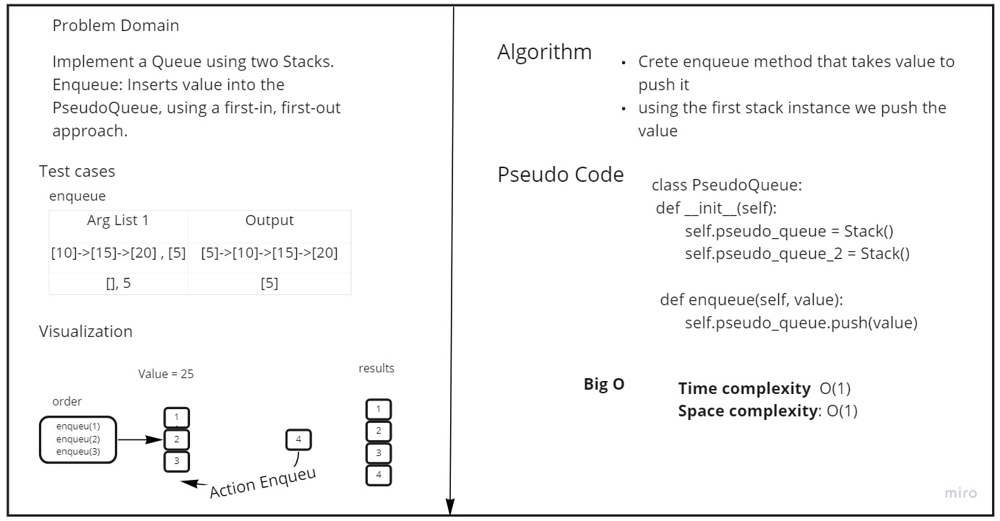
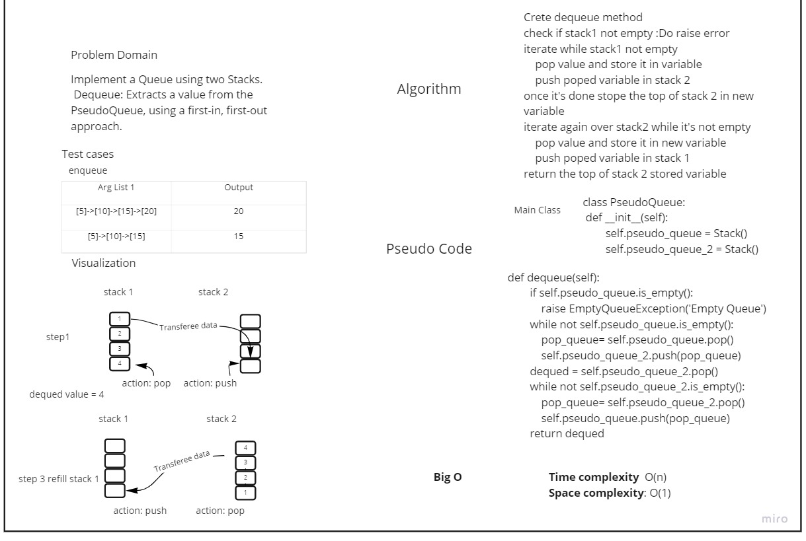

# Challenge Summary
<!-- Description of the challenge -->
Implement a Queue using two Stacks.

## Whiteboard Process
<!-- Embedded whiteboard image -->
Enqueue:
* 
Dequeue:
* 
## Approach & Efficiency
<!-- What approach did you take? Why? What is the Big O space/time for this approach? -->
Enqueue: 
- Time Complexity: O(1)
- Space Complexity: O(1)
- 
Dequeue:
- Time Complexity: O(n)
- Space Complexity: O(1)

## Solution

Enqueue:
```python
     def enqueue(self, value):
        self.pseudo_queue.push(value)
```
Dequeue:
> Algorithm:
> 
> Crete dequeue method
check if stack1 not empty :Do raise error
> 
> iterate while stack1 not empty
>> pop value and store it in variable
>>
>>push poped variable in stack 2
> 
> once it's done stope the top of stack 2 in new variable
> iterate again over stack2 while it's not empty
>> pop value and store it in new variable
> >
>> push poped variable in stack 1
> 
>return the top of stack 2 stored variable
> 
> Code:
```python
      def dequeue(self):
        if self.pseudo_queue.is_empty():
            raise EmptyQueueException('Empty Queue')
        while not self.pseudo_queue.is_empty():
            pop_queue = self.pseudo_queue.pop()
            self.pseudo_queue_2.push(pop_queue)
        dequed = self.pseudo_queue_2.pop()
        while not self.pseudo_queue_2.is_empty():
            pop_queue = self.pseudo_queue_2.pop()
            self.pseudo_queue.push(pop_queue)
        return dequed

```

> Testing:
> 
> * make sure .venv is running and you have pytest installed
> 
> You Can run the test by the following command in the root directory:
> 
> * pytest .\tests\test_stack_queue_pseudo.py     // 7 tests
> 
> or to run all the tests just type:
> 
>  * pytest -v   // 44 tests
 