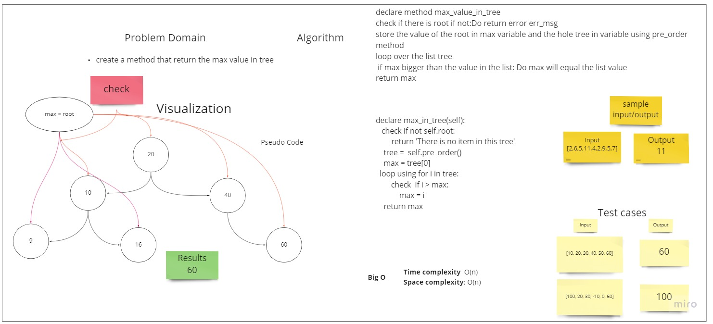

# Challenge Summary
<!-- Description of the challenge -->
find maximum value in tree
## Whiteboard Process
<!-- Embedded whiteboard image -->

## Approach & Efficiency
<!-- What approach did you take? Why? What is the Big O space/time for this approach? -->
I used the pre order method to get all the tree values in a list then I iterate over the
list and check overe the values then return max value
* Time complexity & Space Complexity: O(n)
## Solution
<!-- Show how to run your code, and examples of it in action -->
declare max_in_tree(self):
   check if not self.root:
        return 'There is no item in this tree'
    tree =  self.pre_order()
    max = tree[0]
  loop using for i in tree: 
        check  if i > max:
            max = i
    return max
---

> For testing
> 
> you can run :
> 
> pytest -v    / 75 test passed 
> 
> or 
> 
>  pytest .\tests\test_binary_tree.py    / 14 test passed 

---