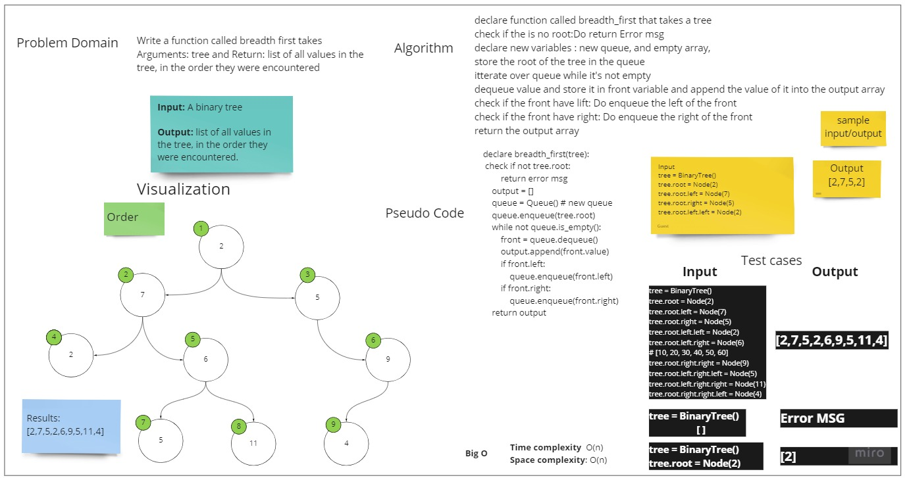

# Challenge Summary
<!-- Description of the challenge -->
Write a function called breadth first  takes Arguments: tree and Return: list of all 
values in the tree, in the order they were encountered

## Whiteboard Process
<!-- Embedded whiteboard image -->

## Approach & Efficiency
<!-- What approach did you take? Why? What is the Big O space/time for this approach? -->
I used Queue to store the data and and after looping over it and dequeue the values and append them to an empty array
in the end return the array that contains the values
Time complexity and Space complexity: O(n)/ O(n)

## Solution
<!-- Show how to run your code, and examples of it in action -->

---
> For Testing
> 
> you can run :
> 
> pytest -v    / 78 test passed 
> 
> or 
> 
>  pytest .\tests\test_binary_tree.py    /  3 test passed 

