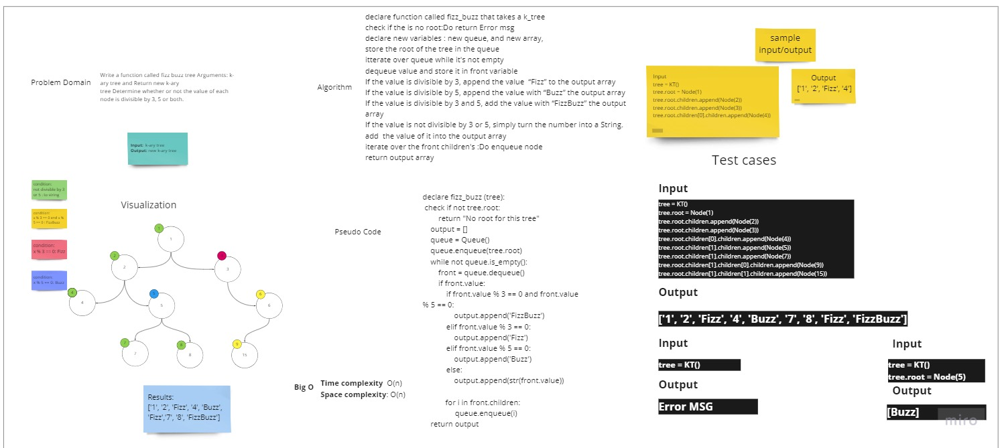

# Challenge Summary

<!-- Description of the challenge -->
Write a function called fizz buzz tree Arguments: k-ary tree and Return new k-ary
tree Determine whether or not the value of each node is divisible by 3, 5 or both.

## Whiteboard Process

<!-- Embedded whiteboard image -->

## Approach & Efficiency

<!-- What approach did you take? Why? What is the Big O space/time for this approach? -->
I use the queue to move easily in the tree and dequeue the value then checkit it mach the needed conditions
for FizzBuzz if not add it to the tree as string.
Time complexity & Space Complexity: Big O(n)

## Solution
<!-- Show how to run your code, and examples of it in action -->

---
Using queue to loop over the tree value and dequeue each node and check if it matches the
fizz buzz rule other wise add it to new tree.

[Code](https://github.com/muhammadqasemtarboush1/data-structures-and-algorithms/blob/main/trees/helper_functions/tree_fizz_buzz/tree_fizz_buzz)

> For testing
> 
> you can run :
> 
> pytest -v    / 72 test passed 
> 
> or 
> 
>  pytest .\tests\test_binary_tree.py    / 11 test passed 

