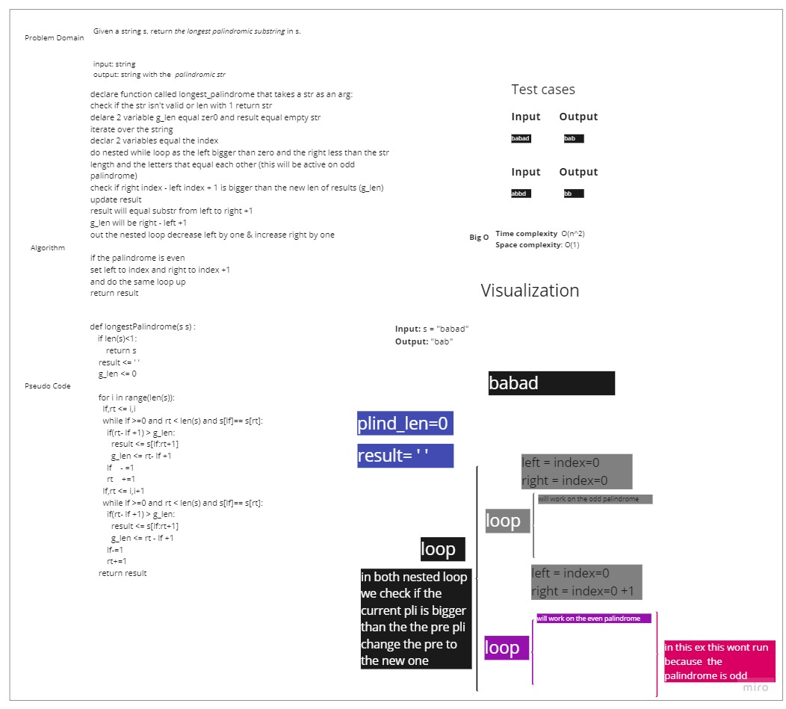
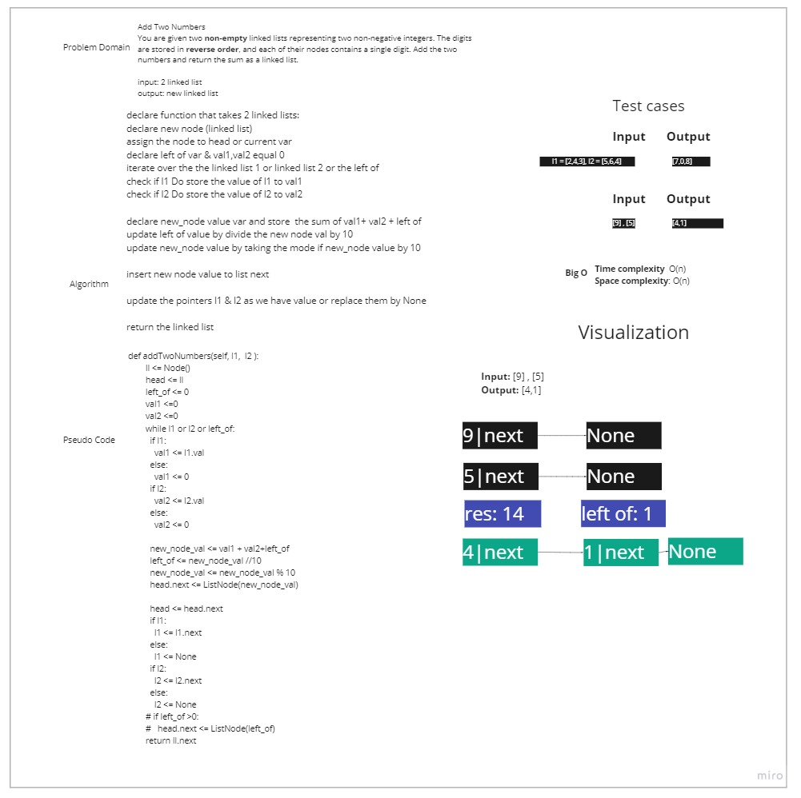
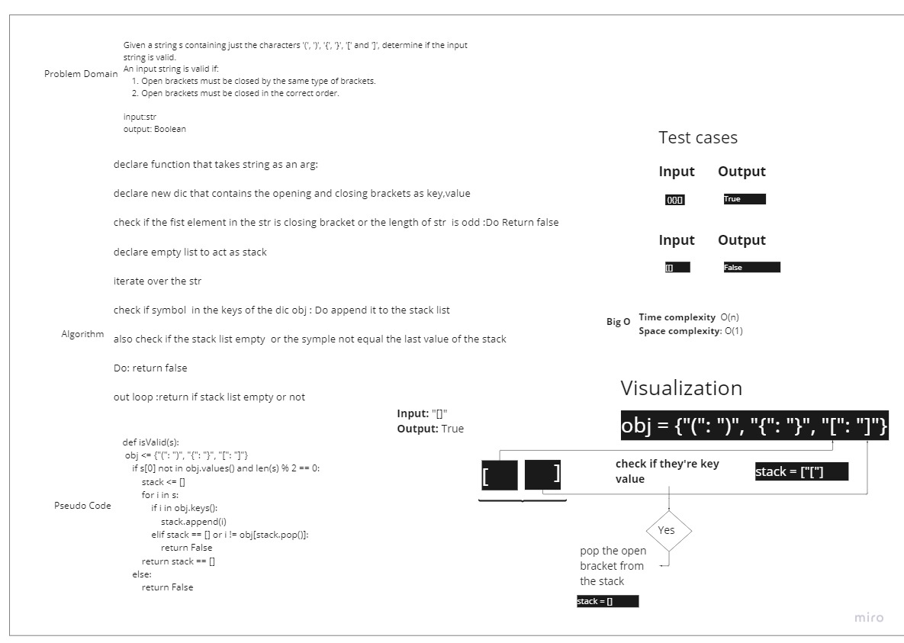

# Lab: Computational Thinking

## Challenge 1: Longest Palindromic Substring
### [Source](https://leetcode.com/problems/longest-palindromic-substring/)

## Challenge 2: Add Two Numbers

### [Source](https://leetcode.com/problems/add-two-numbers/)

## Challenge 2: Add Two Numbers

### [Source](https://leetcode.com/problems/add-two-numbers/)

## Challenge 3: Valid Parentheses

### [Source](https://leetcode.com/problems/valid-parentheses/)

